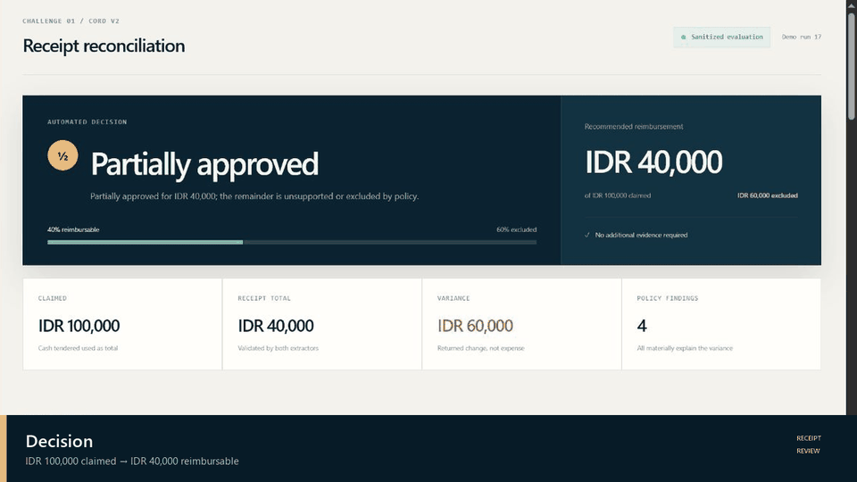
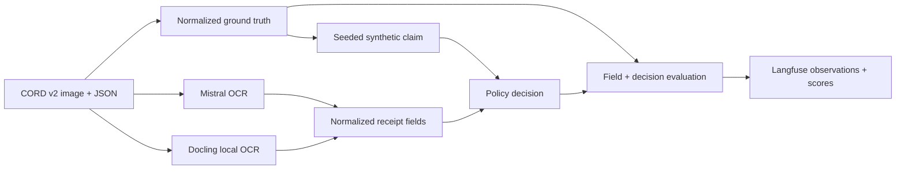

# CORD v2 Receipt Reconciliation

A runnable expense-review challenge built on the
[CORD v2 receipt dataset](https://huggingface.co/datasets/naver-clova-ix/cord-v2).
It downloads a real receipt and its ground-truth JSON, creates a reproducible
synthetic claim, extracts the receipt with Mistral OCR and Docling, applies an
auditable reimbursement policy, and evaluates every result against ground truth.



The GIF follows one claim through the complete workflow: the CORD receipt and
synthetic claim enter two extraction paths, monetary evidence is normalized,
policy controls exclude cash change from the expense, and the final decision is
evaluated and traced in Langfuse. In the demonstrated case, IDR 100,000 was
claimed, IDR 40,000 was supported by the receipt, and IDR 60,000 was returned as
change, so the workflow recommends a partial reimbursement of IDR 40,000.



## Demonstrated result

The checked-in workflow was run live on CORD v2 `train/9`, a receipt for two
Thai iced teas. The receipt shows:

- item/subtotal/final total: IDR 40,000
- cash tendered: IDR 100,000
- change returned: IDR 60,000

The injected claim intentionally requests the cash tendered amount (IDR
100,000). The result is **partially approved for IDR 40,000**. The triggered
rules are `CLAIM_TOTAL_MISMATCH`, `CHANGE_NOT_REIMBURSABLE`, and
`CASH_TENDERED_NOT_REIMBURSABLE`. No further evidence is needed for the supported
IDR 40,000; a corrected claim is needed for full administrative reconciliation.

For this receipt, both Mistral and Docling matched all 11 populated normalized
CORD fields. This is a single worked example, not a dataset-wide accuracy claim.
The current machine-readable outputs are written locally to
`artifacts/langfuse-live/report.json` and `artifacts/langfuse-live/trace.json`.
These runtime evidence files stay local by design and are excluded from Git;
only the sanitized GIF and poster are published.
This run authenticated with Langfuse, flushed successfully, and was read back
through the Langfuse API as trace `bbe2b65c4246e77388348b14c5a934d2` with all
10 observations and eight evaluation scores persisted.

## Setup

Python 3.11-3.13 is supported. Python 3.11 is recommended for Docling.

```powershell
uv sync --extra dev --python 3.11 --system-certs
Copy-Item .env.example .env
```

Put credentials in `.env` (which is gitignored):

```dotenv
MISTRAL_API_KEY=...
LANGFUSE_PUBLIC_KEY=...
LANGFUSE_SECRET_KEY=...
LANGFUSE_BASE_URL=https://cloud.langfuse.com
LANGFUSE_TRACING_ENVIRONMENT=receipt-reconciliation
```

The Mistral key is required. Langfuse credentials are optional for local
development but required to upload traces. A complete redacted local JSON trace
is always written even when Langfuse is not configured.

Use `--require-langfuse` in demonstrations or CI to fail fast unless remote
Langfuse credentials authenticate successfully:

```powershell
uv run receipt-reconcile --split test --seed 2026 --require-langfuse
```

## Run

Reproduce the worked challenge, including Docling:

```powershell
uv run receipt-reconcile `
  --split train `
  --row-index 9 `
  --seed 17 `
  --scenario claimed_cash_tendered `
  --output-dir artifacts/my-run
```

Generate both a random dataset row and a seeded-random inconsistency:

```powershell
uv run receipt-reconcile --split test --seed 2026 --output-dir artifacts/random-run
```

Docling runs locally and downloads OCR artifacts on first use. For a quick
Mistral-only run, add `--skip-docling`.

Available injected scenarios are:

- `exact`
- `claimed_cash_tendered`
- `change_added`
- `tax_doubled`
- `tax_omitted`
- `discount_ignored`
- `item_tampered`
- `unsupported_personal_item`

Omit `--scenario` to choose one reproducibly from `--seed`.

## Review dashboard

The sanitized review UI shown in the GIF is included in
[`web-dashboard/`](web-dashboard/). Run it independently with Node.js 22.13 or
newer:

```powershell
Set-Location web-dashboard
npm ci
npm run dev
```

The committed demo payload contains only the worked CORD example. Local runtime
traces and credentials are never copied into the public dashboard export.

## Evidence and decision semantics

The workflow keeps these values distinct:

- `total_paid` is the final purchase cost and the reimbursement ceiling.
- `cash_tendered` is payment handed over, not an expense.
- `change` is money returned, not an expense.
- tax, discount, service charge, subtotal, item quantities, and line totals are
  retained independently so double counting and ignored discounts are visible.

The live workflow decision uses the normalized Mistral extraction. The CORD JSON
produces the expected decision for evaluation. Docling is an independent OCR
comparison and also acts as a safety gate: disagreement on critical monetary or
payment fields escalates the claim. During this CORD challenge, a Mistral field
accuracy below `--minimum-extraction-accuracy` (default 0.75) also escalates.
Missing final totals or currency evidence escalate; unsupported or
non-reimbursable amounts are deducted; fully unsupported claims are rejected;
and fully supported claims are approved.

## OCR resilience

Mistral OCR first requests a JSON-schema document annotation while retaining its
raw markdown. If a provider returns truncated/malformed structured JSON, the
workflow attempts schema structuring from the OCR text and validates the result.
A deterministic receipt parser is the final guardrail. Docling uses the same
structuring validation and also handles detached reading order, where labels and
amounts are emitted in separate blocks. The strategy used is recorded in each
OCR result and trace.

## Langfuse tracing and evaluation

The Langfuse v4 integration records nested observations for:

1. CORD download and ground-truth normalization
2. synthetic claim generation
3. Mistral OCR and structured extraction
4. Docling OCR and structured extraction
5. each OCR-to-ground-truth comparison
6. expected and actual policy decisions
7. decision evaluation

Scores include per-engine field accuracy, decision-status accuracy, and
reimbursement-amount accuracy. Inputs/outputs are attached to their observation;
credential-shaped fields and bearer values are redacted. Remote Langfuse errors
cannot interrupt reimbursement processing.

Remote observations are data-minimized by default: employee IDs, receipt paths,
merchant/items, raw OCR, ground-truth bodies, and field-by-field evidence are not
sent to Langfuse. The full local trace still contains expense evidence and must
be protected according to the organization's retention and access policy.
`remote_accepted` means the Langfuse SDK accepted a score for asynchronous
delivery; it is not proof that the backend persisted it. `--require-langfuse`
adds an authentication check, while backend verification remains an operational
monitoring responsibility.

## Test

```powershell
uv run pytest
uv run ruff check src tests
python scripts/check_secrets.py
```

Unit tests mock paid APIs and Docling conversion. The live demo artifacts were
produced separately with the real CORD image and OCR services.

## CI/CD

The GitHub Actions workflow in [`.github/workflows/pipeline.yml`](.github/workflows/pipeline.yml)
runs on pull requests and pushes to `main`:

- scans every publishable file for credential-shaped values
- runs Ruff and the complete Python test suite with Python 3.11
- builds and tests the review dashboard with Node.js 22

Pushing a version tag such as `v0.1.0` runs the same gates, builds the Python
wheel and source distribution, packages the dashboard source, and publishes
those files as a GitHub Release. The workflow uses only GitHub's scoped
`GITHUB_TOKEN`; no Mistral or Langfuse credentials are configured in CI.
